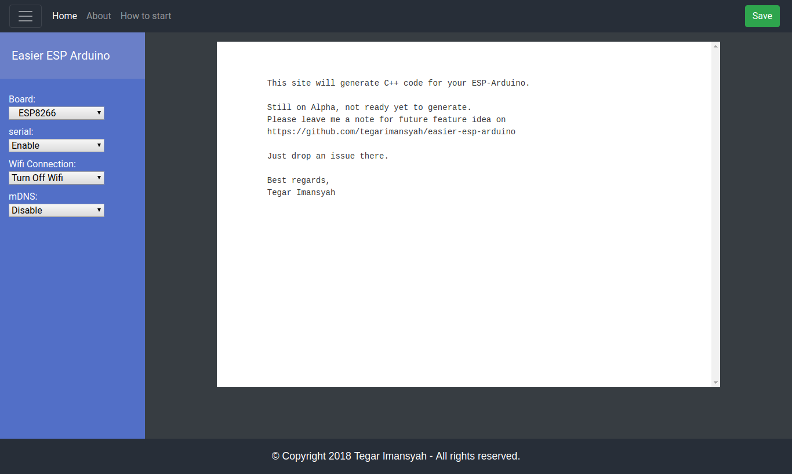

# Easier ESP Generator

This site will generate C++ code for your ESP-Arduino.

Still on Alpha, not ready yet to generate.
Please leave me a note for future feature idea on 
https://github.com/tegarimansyah/easier-esp-arduino/issues

Just drop an issue there.

Best regards,
Tegar Imansyah

----------------------

Screenshot for UI prototype

For system generator, look at jupyter notebook file (*.ipynb*)
